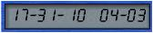



## FloatingClock

### Description

This applications floats on the desktop. It displays the Time and Date. It can be moved. Three skins are available. Skins can be chosen by right clicking on the clock.
 
### More Info
 

             |
---                |---
**Submitted On**   |2002-02-28 08:09:18
**By**             |[Gopinathan](https://github.com/Planet-Source-Code/PSCIndex/blob/master/ByAuthor/gopinathan.md)
**Level**          |Advanced
**User Rating**    |4.2 (21 globes from 5 users)
**Compatibility**  |VB 6\.0
**Category**       |[Complete Applications](https://github.com/Planet-Source-Code/PSCIndex/blob/master/ByCategory/complete-applications__1-27.md)
**World**          |[Visual Basic](https://github.com/Planet-Source-Code/PSCIndex/blob/master/ByWorld/visual-basic.md)
**Archive File**   |[FloatingCl59154342002\.zip](https://github.com/Planet-Source-Code/gopinathan-floatingclock__1-32322/archive/master.zip)

